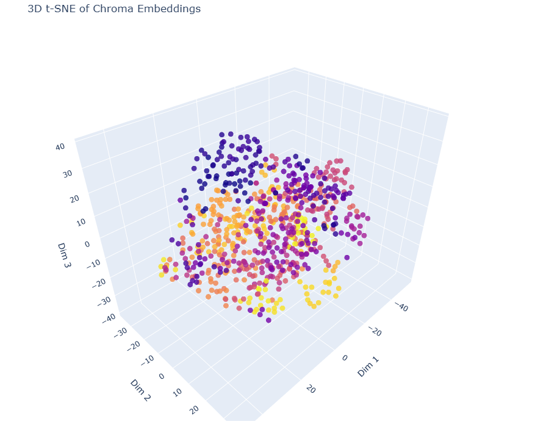

# Plant Disease QA & Detection

[](https://www.python.org/)  
[](https://colab.research.google.com/drive/1u4GbZdSPj6pABmwVIY46jtBdqNdWKYmH#scrollTo=uxI0faoy8Fp7)  
[](LICENSE)


This project combines automated web-scraping, retrieval-augmented LLM question‐answering, and custom object detection into a single, end-to-end pipeline for plant disease diagnosis: first, a helper notebook uses the Google Search API to gather and preprocess a “knowledge base” of plant-disease articles, which are then chunked, embedded via OpenAI, and stored in ChromaDB; next, a custom YOLO model detects and crops diseased regions from uploaded leaf images; finally, both the detection output and the most relevant text passages are wrapped as LangChain tools and served through a Gradio interface, allowing users to upload a leaf photo, see the highlighted disease area, and ask follow-up questions.

---

## 📋 Table of Contents

1. [Features](#features)  
2. [Repository Structure](#repository-structure)  
3. [Quickstart](#quickstart)  
4. [Usage](#usage)  
5. [Dependencies](#dependencies)  
6. [Customization](#customization)  
7. [License](#license)  

---

## 🔍 Features

- **Web Scraping** of plant-disease articles via Google API to build a raw text knowledge base.  
- **Preprocessing** and inspection of scraped documents with cleaning & visualization.  
- **Embeddings & Vector Store**: Chunk long texts, generate OpenAI embeddings, and persist them in ChromaDB.  
- **Custom YOLO Model**: Load your own `best.pt` weights to detect and crop diseased leaves.  
- **LangChain Tools**: Wrap both detection and retrieval-QA as callable tools for an LLM agent.  
- **Interactive Gradio App**: Upload leaf images, detect disease, and ask follow-up questions in natural language.  

---

## 🗂 Repository Structure

```
.
├── Plant_Disease_QA_Rag.ipynb       # RAG Pipeline, Langchain + GPT API Calling
├── Web_scrapper.ipynb               # Scrapes and saves disease-related web content
├── Knowledge_base.ipynb             # Creates the Knowledge Base from the links by scraping the Data and storing them in Markdown Format.
├── diseases_with_links.csv          # Keywords and top 5 Links 
├── LICENSE                          # MIT License file
├── data/
│   ├── knowledge_base/              
│   └── Apple_scab_Leaf              # Raw `.txt` or `.md` files from the scraper
|     └── About
|     └── Cure             
└── models/
    └── best.pt                      # Trained YOLO model weights
```

---

## 🚀 Quickstart

1. **Clone the repository**  
   ```bash
   git clone https://github.com/your-username/plant-disease-qa.git
   cd plant-disease-qa
   ```

2. **Prepare your data**  
   - If using Google Colab, mount your Drive:  
     ```python
     from google.colab import drive
     drive.mount('/content/drive')
     ```  
   - Ensure the following paths are populated:  
     - `data/diseases_with_links.csv` (your disease keywords & seed links)  
     - `data/knowledge_base/` (raw `.txt` files from the scraper)  
     - `models/best.pt` (your YOLO weights file)
    
3. - Links:
     - Web_scrapper.ipynb : https://colab.research.google.com/drive/1zG_uQYFZY9JZ3pEqTCxE7GSv3pOO6FtP?usp=sharing
     - Yolov12_Plant_Disease_Detection.ipynb : https://colab.research.google.com/drive/1DZB-L4II6bK_OW2aHbespsTiIL-LnPrS

4. **Build or update the vector store**  
   If you’ve added or updated documents in `data/knowledge_base/`, open **`Knowledge_base.ipynb`** or the “Embeddings & Chroma” section of **`Plant_Disease_QA_Rag.ipynb`** and rerun those cells to regenerate `data/chroma_db/`.

5. **Run the main notebook**  
   Open **`Plant_Disease_QA_Rag.ipynb`** in Colab or Jupyter. Execute all cells—at the end, a Gradio UI will launch.  
   Upload a leaf photo and ask questions such as:  
   > “What disease is affecting this leaf?”  
   > “What treatment methods are recommended for bacterial spot?”

## 📈Results 

<p align="center">
  
</p>

3D-Plot for Vector Embeddings

<p align="center">
  
</p>

Image Detector Inference

<p align="center">
  
</p>
Chat Bot GUI

<p align="center">
  
</p>
Disease Inference

<p align="center">
  
</p>
Debugging

<p align="center">
  
</p>
Image detector in Chatbot

---

## 🔧 Dependencies


- **Gradio** — Lightweight UI framework  
- **LangChain** & **langchain-community** — LLM orchestration & community extensions  
- **OpenAI** (or other LLM provider) + **ChromaDB** — Embeddings & vector store  
- **Ultralytics YOLO** — Object detection  
- **Roboflow**, **Supervision**, **Flash-Attn** — Optional vision utilities  
- **scikit-learn**, **matplotlib** — Data analysis & visualization  

## 🛠️ Customization

- **Add or Update Diseases**  
  1. Update your keyword list in `Web_scrapper.ipynb` and rerun the scraper.  
  2. Clean and preprocess in `Knowledge_base.ipynb`.  
  3. Rerun the embedding/chroma cells in `Plant_Disease_QA_Rag.ipynb`.

- **Swap Your LLM**  
  Edit the `MODEL` variable in `Plant_Disease_QA_Rag.ipynb` (e.g., change to `gpt-4o-mini` or another supported model).

- **Retrain or Replace YOLO**  
  Place your new `best.pt` under `models/` and update the detection cell in `Plant_Disease_QA_Rag.ipynb` to point to your custom weights.

---

## 📄 Useful Links 

Plant disease detector: [GitHub](https://github.com/shivasamkumar/Plant_Disease_and_weed_detector)

Model File: [Model Link](https://drive.google.com/file/d/18j6vjY4O4dmUYPxRNkz1mKxrTzvdJujx/view?usp=sharing)

Dataset: [Dataset](https://universe.roboflow.com/floragenic-9v9os/plant-disease-detection-3anip)


